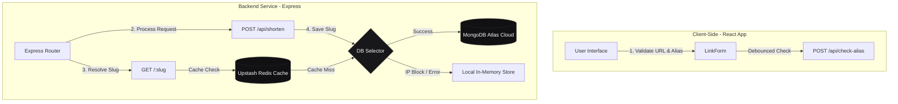

# LinkSense

LinkSense is a premium, developer-first URL shortener designed with extreme minimalist aesthetics inspired by Linear and Vercel. Built on a robust Express backend and a mobile-first React frontend, it provides secure, zero-dependency alias redirection and dynamic check validations. It runs with automatic database fallback options (Mongoose Atlas and Upstash Redis) to ensure seamless local testing and deployment.

---

## Overview

LinkSense simplifies link management for developers and teams by providing a clean, distraction-free environment to shorten, validate, and redirect links. It focuses on quiet confidence through typography, proportions, and visual restraint rather than flashy marketing graphics. It features live URL validation, debounced alias availability checking, and client-side resolution fallbacks.

---

## Tech Stack

*   **Frontend**: React (Vite), Inter & Share Tech Mono Fonts, Vanilla CSS (8px grid system).
*   **Backend**: Node.js, Express (ES Modules).
*   **Database**: MongoDB Atlas (Mongoose ODM).
*   **Cache**: Redis (Upstash TCP client via `ioredis`).
*   **Deployment**: Vercel (Client), Render/Railway/Self-Hosted (Server).

---

## Project Structure

```text
LinkSense/
├── Client/                     # Frontend Vite React App
│   ├── dist/                   # Production compiled output (ignored)
│   ├── public/                 # Static assets (logo.svg, sitemap.xml, robots.txt)
│   ├── src/                    # React Source Files
│   │   ├── config/             # Config files (constants.js)
│   │   ├── pages/              # Router Page components
│   │   ├── utils/              # Helper utilities (validation.js)
│   │   ├── App.css             # Main styling system
│   │   ├── App.jsx             # Application core entry
│   │   └── main.jsx            # React root mount
│   ├── index.html              # Vite entry template
│   └── package.json            # Client scripts & dependencies
│
├── Server/                     # Backend Express API
│   ├── src/                    # Express App Source
│   │   ├── config/             # DB & Redis connection handlers (env.js, db.js, redis.js)
│   │   ├── models/             # Mongoose Schemas (Url.js)
│   │   ├── services/           # DB storage hooks & fallback drivers (urlService.js)
│   │   ├── utils/              # Extension filters (blockedExtensions.js)
│   │   └── app.js              # Express routing logic
│   ├── .env                    # Local environment variables (ignored)
│   ├── index.js                # Server entry point
│   └── package.json            # Server scripts & dependencies
│
└── README.md                   # Repository documentation
```

---

## Key Directories Explained

### `/Client`
Contains the Vite React frontend. Handles input validation, custom alias checks, active button states, and live link previews.

### `/Server`
Contains the Express server backend. Manages routing, databases connections, cache reads, and handles HTTP redirects.

### `/src` (within Client & Server)
Houses the functional logic. Inside the client, it holds layouts and styling; inside the server, it houses database models, routes, and utilities.

---

## Architecture Overview

1.  **Request Flow**: When a user enters a long URL and submits the form, the Client validates it locally and hits the Server's `/api/shorten` route.
2.  **Shortening Logic**: The Server processes the request, filters against blocked file extensions, and stores the mapping (alias -> long URL) in MongoDB.
3.  **Caching**: Upon initial redirection, the Server queries MongoDB, caches the mapping in Redis, and redirects the client. Subsequent redirects are served from Redis.
4.  **Graceful Database Fallback**: If MongoDB connection fails (e.g., due to IP whitelisting restrictions), the Server switches to a secure **in-memory storage mode** to guarantee functional local environments.

---

## Key Features

*   **Premium Minimalist Interface**: Clean dark theme with white/black action buttons and smooth 150ms transitions.
*   **Live Custom Alias Autocomplete**: Queries availability debounced (400ms) and outputs 5 smart suggestion chips when taken.
*   **Live Preview**: Monospaced typography previewing the short link (`linksense.vercel.app/{your-alias}`) dynamically.
*   **Malicious File Prevention**: Rejects submissions pointing to executable or document extensions (e.g., `.exe`, `.dmg`, `.zip`).
*   **Keyboard Accessibility**: Complete keyboard navigation (Arrow keys and Enter) for suggestion chips.

---

## System Architecture


Below is the request lifecycle and system layout showing the primary Express router, cache checks, and automatic database fallback selection:



### System Design Specifications

*   **Identifier Generation**: Uses **`nanoid(6)`** to generate secure, cryptographically random, and URL-safe 6-character short IDs (e.g., `x7K9ap`), guaranteeing collision-free links without needing database-backed auto-incremented counters.
*   **Custom Alias Checking & Suggestions**: Dynamic debounced availability validator that checks alias reservations and generates 5 alternative options (prefixes, suffixes, and random hashes) if already taken.
*   **Database Fallback Layer**: An automatic database selector check. If the MongoDB Atlas cloud cluster is unreachable (due to firewalls or IP restrictions), it automatically switches storage to a local **in-memory store** to avoid server crashes.
*   **Cache Tier**: Serves redirects directly from **Upstash Redis** cache on hit to ensure low-latency redirection (under 10ms) and reduce MongoDB Atlas database read loads.

---

## Getting Started

### Prerequisites
*   Node.js (v18 or higher)
*   npm (v9 or higher)

### Environment Variables

Create a `.env` file in the `/Server` folder:
```env
PORT=5000
MONGODB_URI=your_mongodb_atlas_connection_string
REDIS_URL=your_redis_connection_string
```

### Local Development

1.  **Start the Backend Server**:
    ```bash
    cd Server
    npm install
    npm run dev
    ```
    The server will connect to MongoDB/Redis (or fallback to memory store) and run on `http://localhost:5000`.

2.  **Start the Frontend Client**:
    ```bash
    cd Client
    npm install
    npm run dev
    ```
    The client interface will run on `http://localhost:5173`.

---

## API Routes

### 1. Health Status
*   **Route**: `GET /api/health`
*   **Description**: Validates backend server status and uptime.

### 2. Check Alias Availability
*   **Route**: `POST /api/check-alias`
*   **Payload**: `{ "alias": "portfolio" }`
*   **Response**: Returns availability and alternative options:
    ```json
    {
      "available": false,
      "suggestions": ["my-portfolio", "portfolio-dev", "portfolio2026", "portfolio-1"]
    }
    ```

### 3. Shorten URL
*   **Route**: `POST /api/shorten`
*   **Payload**: `{ "originalUrl": "https://...", "customKeyword": "my-alias" }`

### 4. Resolve URL
*   **Route**: `GET /api/resolve/:slug`
*   **Description**: Retrieves destination URL mappings from database/cache.

### 5. Redirect Destination
*   **Route**: `GET /:slug`
*   **Description**: Handles HTTP 302 redirection.

---

## Frontend Routes

*   **Home Page (`/`)**: Main shortening interface card.
*   **Redirect Page (`/:slug`)**: Resolves the slug and triggers client-side redirect routing.

---

## Technologies Used

*   **Vite** & **React 19**
*   **Express 5**
*   **Mongoose 9**
*   **ioredis**
*   **Lucide React**