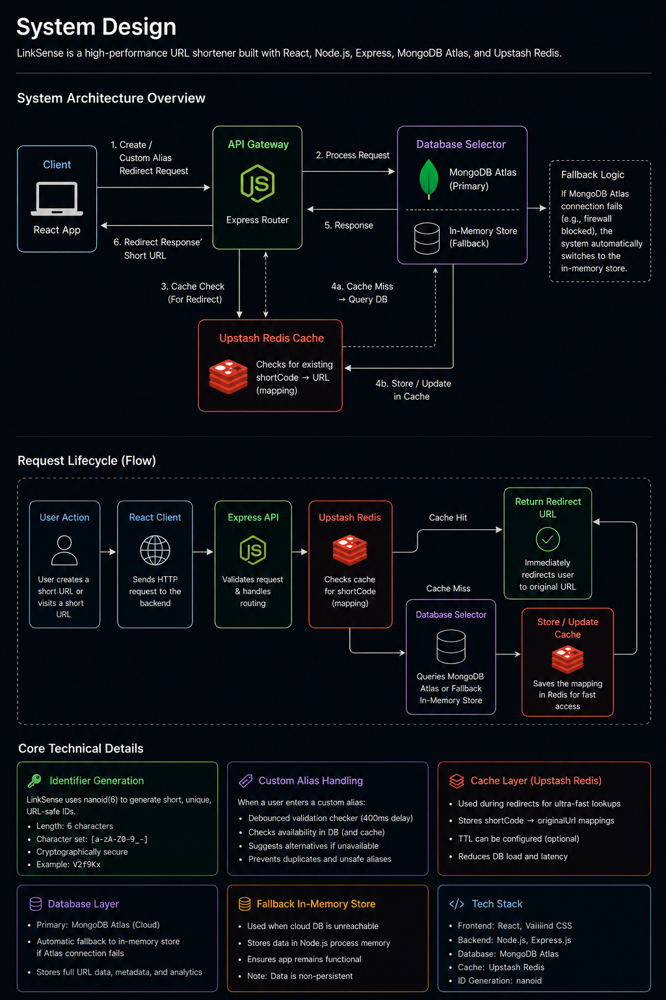
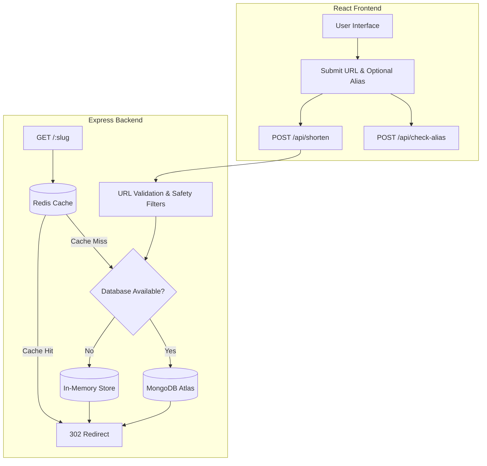

# LinkSense

## Why I Built LinkSense

Most URL shorteners, like **Bitly** and **TinyURL**, do their job well—they generate short links that are easy to share. However, the generated URLs are often random, difficult to remember, and provide little context about the destination.

While using these services, I found myself wondering:

> **Why can't a URL shortener create links that are meaningful instead of random?**

That question became the starting point for **LinkSense**.

LinkSense is a developer-first URL shortener that lets anyone create clean, keyword-based short links without creating an account or paying for premium features. The goal is simple: make link sharing faster, more intuitive, and accessible to everyone.

Beyond shortening URLs, LinkSense focuses on reliability and performance. It validates URLs before storing them, checks custom aliases in real time, and uses Redis caching to deliver fast redirects while reducing database load. The application is built with a scalable architecture using React, Node.js, Express, MongoDB, and Redis, making it suitable for both local development and production deployments.

---
## Project Structure

```text
LinkSense/
├── Client/                     # React frontend (Vite)
│   ├── dist/                   # Production build output (ignored)
│   ├── public/                 # Static assets
│   ├── src/
│   │   ├── config/             # Application constants
│   │   ├── pages/              # Route components
│   │   ├── utils/              # Validation helpers
│   │   ├── App.css             # Global styling
│   │   ├── App.jsx             # Main application component
│   │   └── main.jsx            # React entry point
│   ├── index.html
│   └── package.json
│
├── Server/                     # Express backend
│   ├── src/
│   │   ├── config/             # Database & Redis configuration
│   │   ├── models/             # Mongoose models
│   │   ├── services/           # Data access layer
│   │   ├── utils/              # URL validation & safety filters
│   │   └── app.js              # API routes and application setup
│   ├── .env                    # Environment variables (ignored)
│   ├── index.js                # Server entry point
│   └── package.json
│
└── README.md
```

---

## Directory Overview

### `Client/`

The frontend of LinkSense, built with React and Vite. It provides the user interface, validates input before submission, checks custom alias availability, and communicates with the backend to create and resolve short links.

### `Server/`

The backend API built with Express. It is responsible for generating short links, validating requests, storing data in MongoDB, caching frequently accessed links with Redis, and redirecting users to their original destinations.

### `src/`

Both the client and server organize their source code inside a `src` directory to keep the project modular and maintainable. Business logic, utilities, configurations, and application components are separated into dedicated folders, making the codebase easier to navigate and extend.

## Architecture Overview

LinkSense follows a simple request flow designed for fast and reliable URL redirection.

1. A user submits a long URL along with an optional custom alias.
2. The frontend validates the input before sending it to the backend.
3. The backend performs additional validation, filters unsafe URLs, and stores the mapping in MongoDB.
4. On the first redirect, the original URL is fetched from MongoDB and cached in Redis.
5. Future requests are served directly from Redis, reducing database lookups and improving redirect performance.
6. If MongoDB is unavailable during local development, the application automatically switches to an in-memory storage mode, allowing the project to continue functioning without interruption.

---

## Key Features

* **No sign-up required** — Create and share short links instantly.
* **Custom aliases** — Generate meaningful, human-readable links instead of random strings.
* **Live URL validation** — Detect invalid URLs before submission.
* **Real-time alias availability** — Instantly checks whether a custom alias is already in use.
* **Redis caching** — Speeds up redirects by caching frequently accessed links.
* **Security filtering** — Blocks unsafe domains and restricted file types before creating a short link.
* **Google Safe Browsing support** *(optional)* — Integrates with Google's Safe Browsing API for additional threat detection when an API key is configured.
* **Keyboard-friendly interface** — Fully navigable using the keyboard for improved accessibility.
* **Responsive design** — Optimized for desktop, tablet, and mobile devices.

---

## Security

LinkSense includes multiple validation layers to help prevent the creation of unsafe short links.

* Blocks commonly abused domains using a curated blocklist.
* Rejects links pointing to potentially harmful file types such as executable or compressed files.
* Performs both client-side and server-side validation to prevent invalid or restricted URLs from being processed.
* Supports optional Google Safe Browsing integration for real-time threat detection.
## System Architecture





The diagram below illustrates how LinkSense processes requests, validates URLs, stores data, and serves redirects efficiently.





---


## System Design Highlights


* **Unique Identifier Generation** — Uses `nanoid(6)` to generate short, URL-safe, collision-resistant identifiers.

* **Custom Alias Support** — Users can create meaningful aliases, with real-time availability checks and automatic suggestions if an alias is already taken.

* **Multi-layer Validation** — Every URL passes through client-side and server-side validation before being stored.

* **Security Filtering** — Blocks restricted domains and potentially harmful file types before creating a short link.

* **Redis Caching** — Frequently accessed links are cached to reduce database reads and improve redirect performance.

* **Automatic Database Fallback** — If MongoDB is unavailable during local development, the application seamlessly switches to an in-memory store without interrupting functionality.


---


## Getting Started


### Prerequisites


* Node.js **18+**

* npm **9+**


### Environment Variables


Create a `.env` file inside the `Server` directory.


```env

PORT=5000

MONGODB_URI=your_mongodb_connection_string

REDIS_URL=your_redis_connection_string

GOOGLE_SAFE_BROWSING_KEY=your_api_key   # Optional

```


### Run Locally


Start the backend:


```bash

cd Server

npm install

npm run dev

```


Start the frontend:


```bash

cd Client

npm install

npm run dev

```


The application will be available at:


* Frontend → `http://localhost:5173`

* Backend → `http://localhost:5000`


---


## API Endpoints


| Method | Endpoint             | Description                          |

| ------ | -------------------- | ------------------------------------ |

| `GET`  | `/api/health`        | Check backend status                 |

| `POST` | `/api/check-alias`   | Check custom alias availability      |

| `POST` | `/api/shorten`       | Create a new short link              |

| `GET`  | `/api/resolve/:slug` | Resolve a short link                 |

| `GET`  | `/:slug`             | Redirect to the original destination |


---


## Frontend Routes


| Route    | Description                                     |

| -------- | ----------------------------------------------- |

| `/`      | Home page for creating short links              |

| `/:slug` | Resolves and redirects the requested short link |

## 🛠️ Tech Stack

### Frontend

* **React 19** – Builds the user interface.
* **React Router v7** – Handles client-side routing.
* **Vite** – Fast development server and optimized production builds.
* **Lucide React** – Modern icon library.

### Backend

* **Node.js & Express** – REST API and routing.
* **MongoDB Atlas & Mongoose** – Persistent URL storage.
* **Upstash Redis & ioredis** – Caches frequently accessed links for faster redirects.
* **nanoid** – Generates short, URL-safe unique identifiers.

### Deployment

* **Vercel** – Frontend hosting.
* **Render / Railway** – Backend hosting.

---

## 📚 Learning & Inspiration

Building LinkSense gave me an opportunity to learn how production-ready URL shorteners are designed, particularly around caching, redirects, and scalable backend architecture.

Some resources that helped shape the project include:

* **NeetCode – URL Shortener System Design**
* Official documentation for **React**, **Express**, **MongoDB**, **Redis**, and **Vercel**

While the project takes inspiration from services like Bitly and TinyURL, every feature and implementation in LinkSense was built from scratch as part of my learning journey.
